# web-store

## Links

Frontend : https://webstore-frontend-ebon.vercel.app/

Backend : https://web-store-production.up.railway.app

API documentation :https://documenter.getpostman.com/view/19781326/2sAYdoG7ns

## How to setup locally

- First step is clone this repository using `git clone <repo link>` and go to the cloned directory.

### Backend

To setup backend, follow this step:

- Change directory to backend using `cd backend`
- Install all necessary package using `npm install`
- Create .env file based on the provided .env.example. Fill it with your own database credential and make sure all is rightly filled.
- Next step is setup database. Here i use postgreSQL and this is how you can set it up.

  - First you need to create database, you can name it whatever you want. But here i create with the same name as my web app name which is 'webstore'. You can create it via terminal with syntax below:

    ```
    psql -U postgres -h localhost -p 5432 -W
    ```

    It will require you to enter your password for postgreSQL.

    After that, you can create database using this syntax `CREATE DATABASE webstore;`

  - Next step is performing database migration. The tool i use is knex and you can see the file here -> [Knexfile](./backend/knexfile.js) ,[Schema](./backend/src/config/database/script/schema.sql), [Migrations](./backend/src/config/database/migrations).

    To perform a database migration, you can run this syntax:
    `npm run db-setup`, that syntax will rollback and then migrate up all migrations.

- After the database migration is complete. The next step is performing database seeding. You can do it using this syantax `npm run db-seed`. It's the syntax that will run [Seeding File](./backend/src/config/database/seed/create_products_seed.js) which is a file for bulk insert product data.
- After all the step above is done, you can now run the app using `npm run dev` or `npm run start`

### Frontend

- To setup frontend, you need to change directory to frontend.
- After that, install all necessary dependency and fill create .env file based on .env.example. Fill it with your backend address (e.g http://127.0.0.1:5000).
- Then, you can run it using `npm run dev`.

## Feature Covered

### Backend

- tech stack

  - language : node.js (fastify)
  - database : postgreSQL
  - migration tool : knex
  - unit test : mocha & chai

- Database Setup
  - schema : [Schema](./backend/src/config/database/script/schema.sql)
  - migration : [Migrations](./backend/src/config/database/migrations)
- CRUD Product
- Bulk import and seeding
- Stock adjustment via delta
- Unit test

  - test

    You can try the unit test with this syntax : `npm run test`

  - coverage

    This syntax to show coverage table : `npm run test:coverage`.

    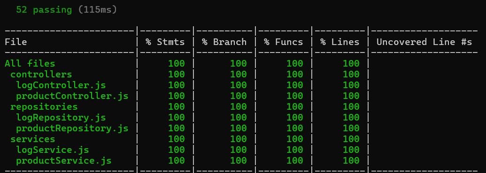

  - coverage file

    This syntax to show coverage file based : `npm run test:coverage-html`. To see the result you can go to './coverage/index.html' and run it in your browser.

    

### Frontend

- tech stack
  - language or framework : Next.js + typescript
  - state management (cart & checkout) : context & localstorage
  - API Fetching : axios
  - Component Libary : shadcn/ui
  - styling : tailwind
- admin panel

  - product management

    - list
      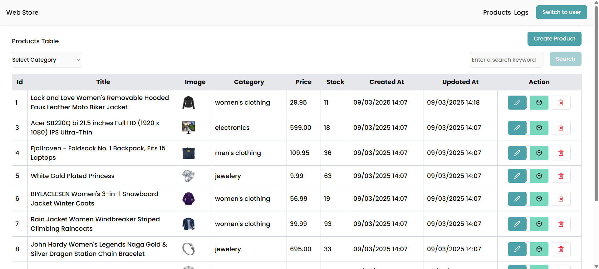
    - create
      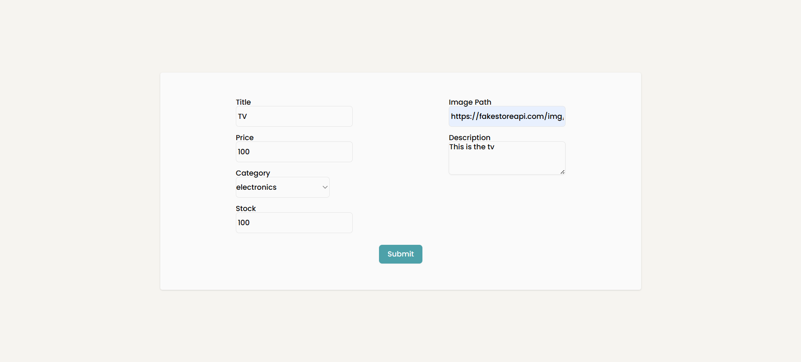
    - update
      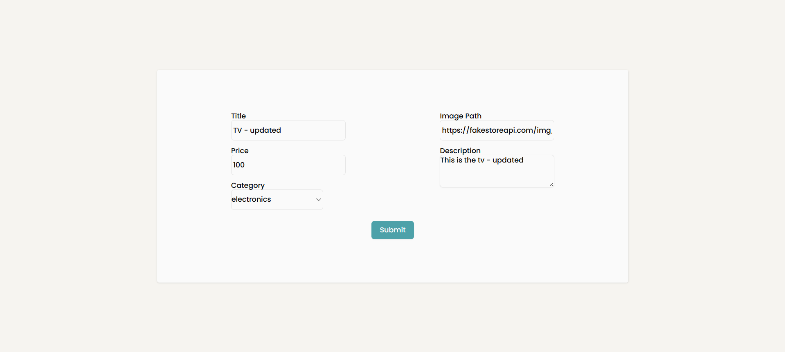
      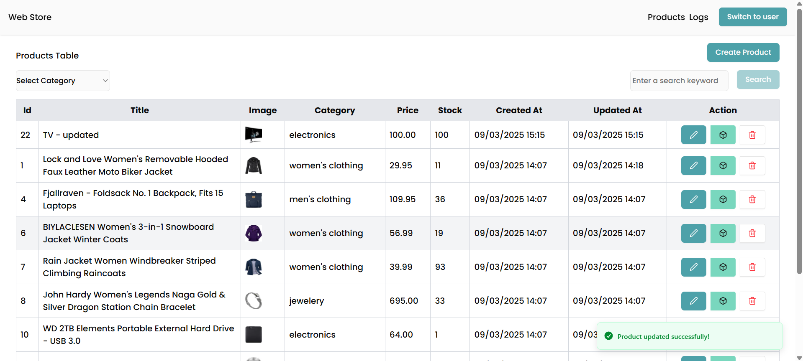
    - delete with confirmation
      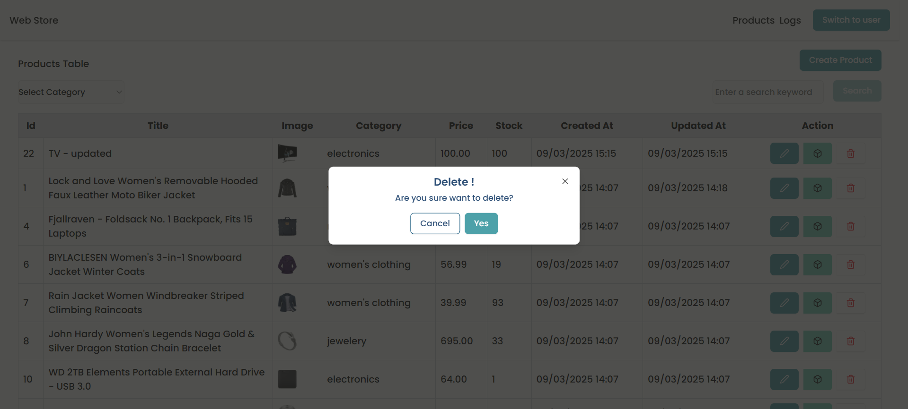
      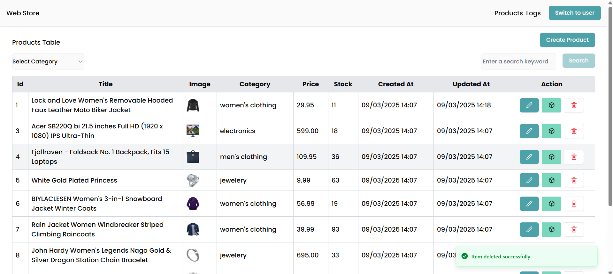

  - stock adjustment
    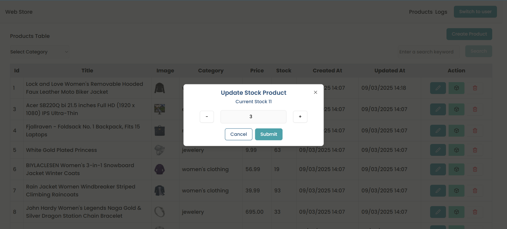
    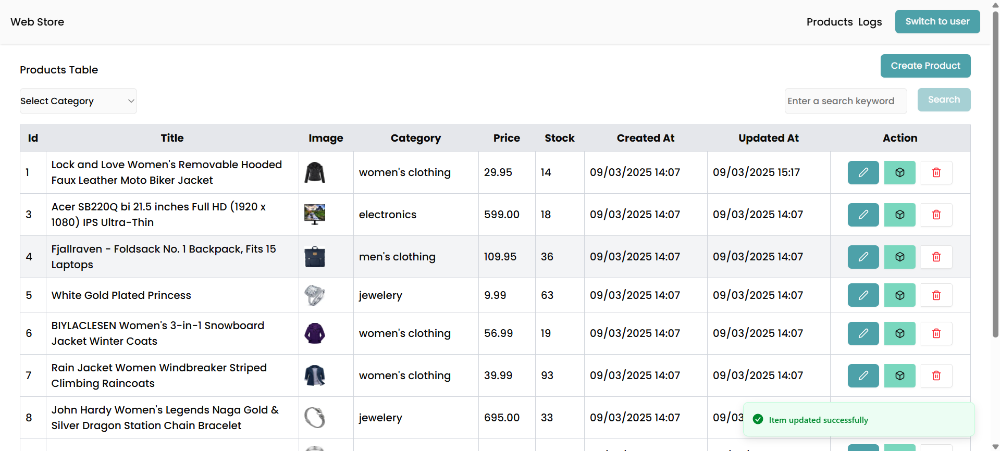

- client side
  - product listing
    - list (already implement infinite scroll with search and filter)
      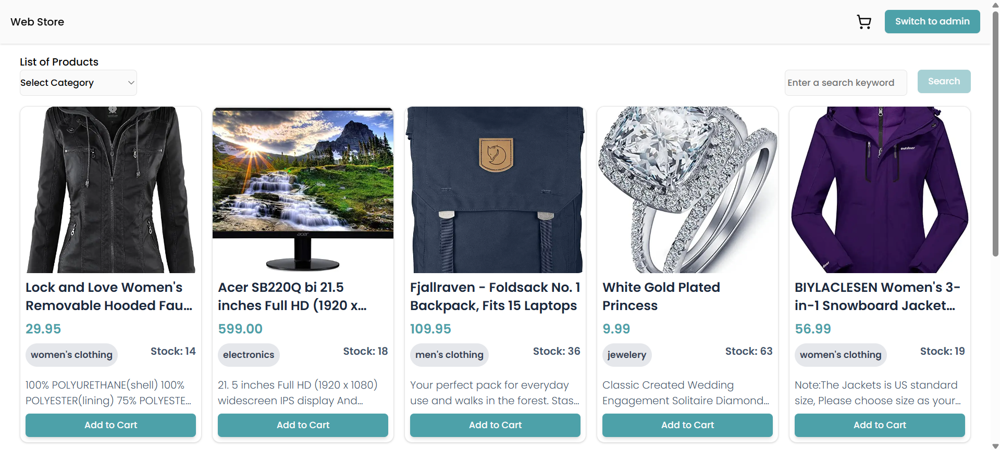
    - detail
      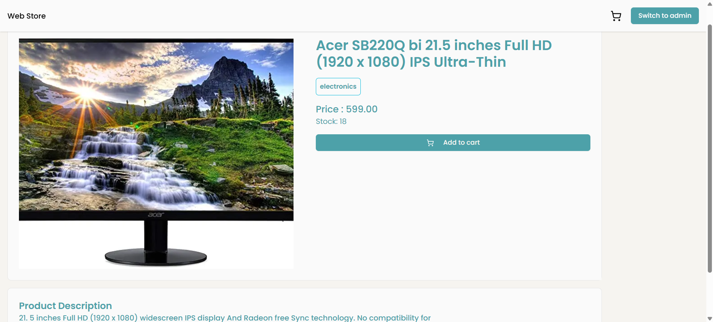
  - shopping cart & checkout
    - cart
      - add to cart
        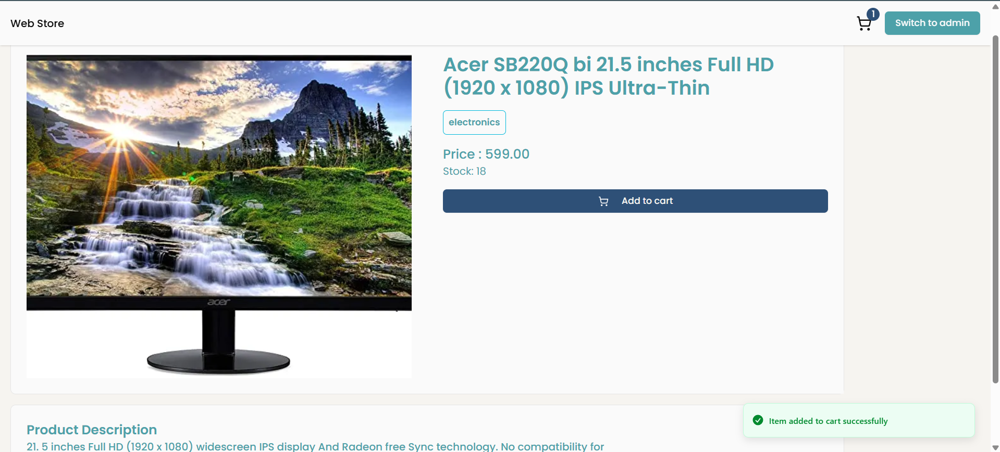
        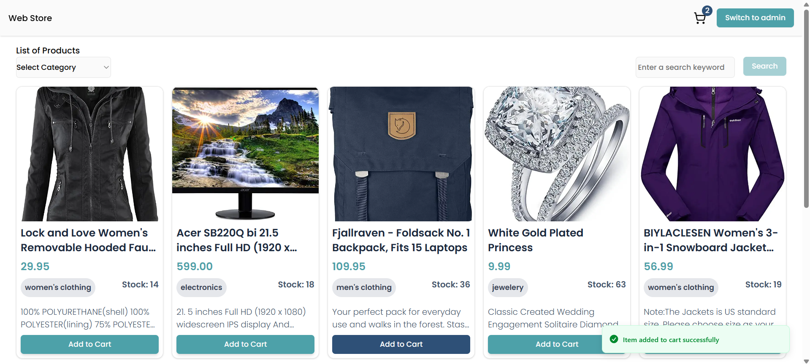
      - cart page
        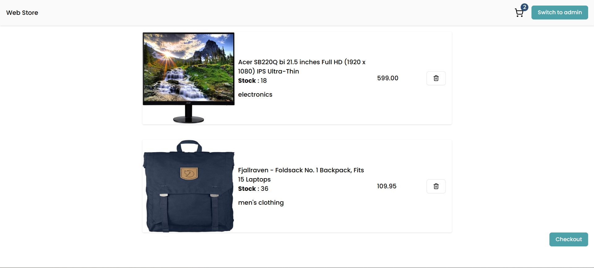
      - remove from cart
        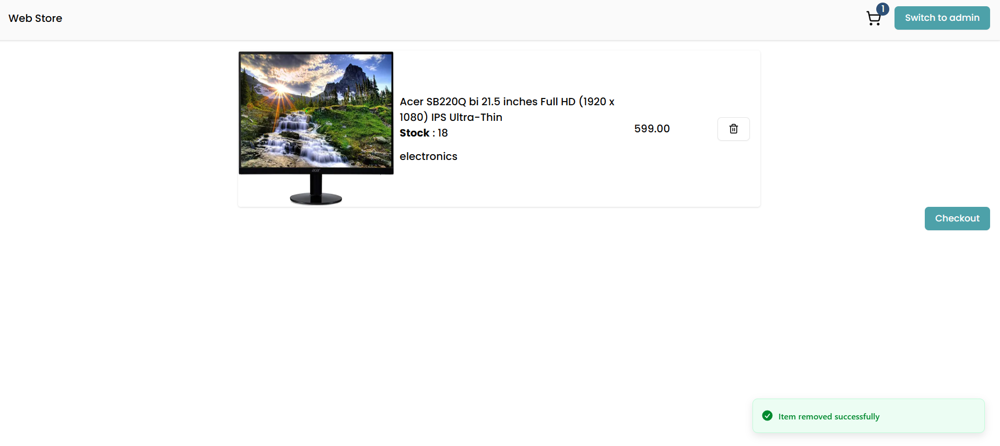
    - checkout
      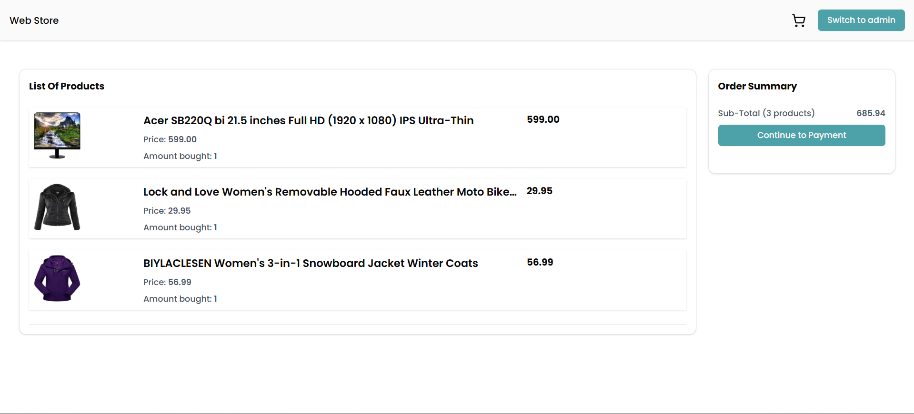

### Fire events analytics

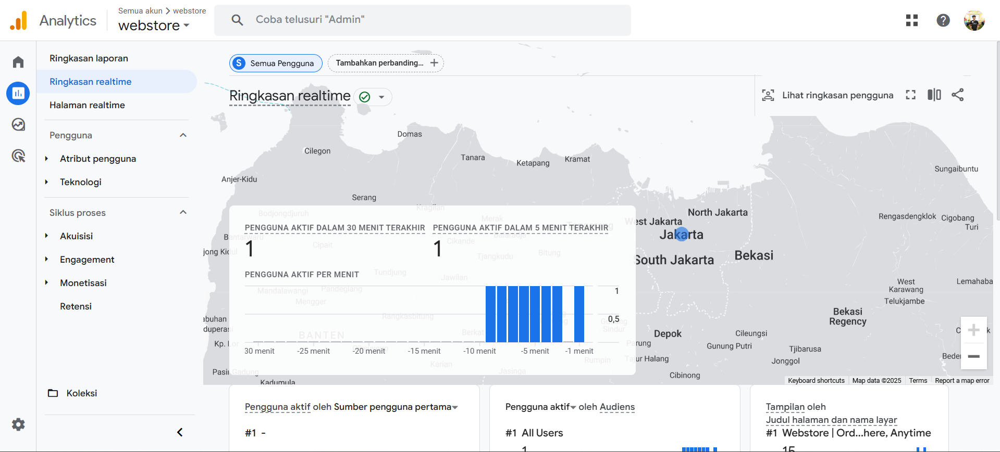
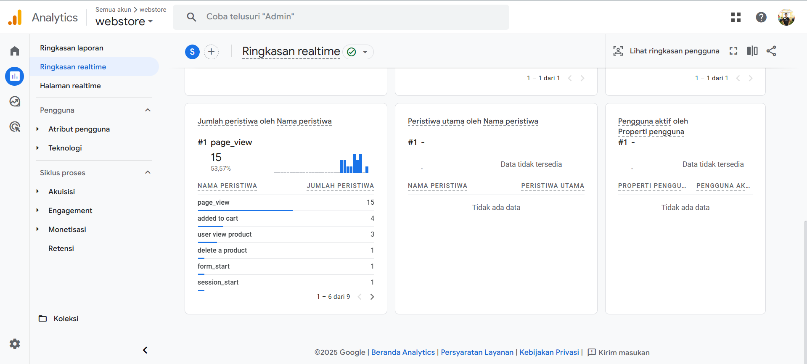
